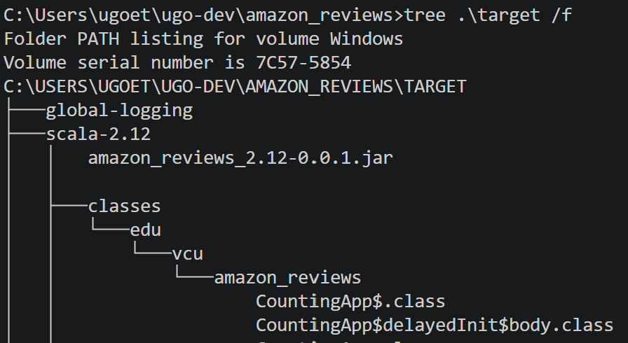

# Lab 4 Analyzing Online Reviews Using Spark

You must read through the detailed README in the [sample_spark_job](https://github.com/ugoetudo/bda-dataproc-guide/tree/main/spark_scripts/sample_spark_job) repository before attempting anything here.

This program scaffolding was created using the Scala Build Tool (sbt). The files CountingApp.scala and WordCount.scala were created by a common Spark archetype template. I modified WordCount.scala here, reusing its code for Lab 4 and extending its functionality to suit the Lab's requirements.

Install [sbt](https://www.scala-sbt.org/1.x/docs/Installing-sbt-on-Windows.html) on Windows, rather than WSL. You'll be able to write your Spark programs using Scala in VSCode with fewer hiccups if you do so. 

Add the "Scala (Metals)" and "Scala Syntax" extensions to VSCode for rich IDE features and language support such as intellisense and linting. 

Once installed, navigate to a location where you'd like to create your Spark project and enter: 

```sh
sbt new holdenk/sparkProjectTemplate.g8
```

When you open `spark-shell` note the Scala and Spark verisons. You'll supply those version codes when prompted by the above command. This will create the very scaffolding that you see here along with CountingApp.scala and WordCount.scala files in your src directory. 

You're good to go!

## Why Avoid the `spark-shell` Scala REPL?

 While you can complete this assignment in the REPL (spark-shell), it is instructive to see how you may create a Spark Job in the form of a Scala program that satisfies the assignment's requirements. A few advantages to this approach:
* The spark-shell is a clumsy way to write code. When you exit your session, you typically cannot recreate your work unless you explicitly saved your inputs in the REPL. See the [Scala REPL](https://docs.scala-lang.org/overviews/repl/overview.html) (spark-shell is just the Scala REPL with Spark primitives built in) docs.
* You can't expect that you will have access to spark-shell in production environments
* You can't easily provide downstream customers with easy to use analytics
* The list goes on...

## Run in Spark with `spark-submit`

The `spark-submit` utility lives in your $SPARK_HOME/bin directory. First, build and package this project to a jar with `sbt`:
```sh
sbt package
```
Then in the `target` directory of the project (recall this is where deployment artefacts are traditionally kept in Java builds), find the JAR file:



Copy the JAR to a location in `/home/hadoop/..` on WSL.

We want to run the `ReviewSentimentApp` object (a scala object is Java static class of the sort you'd use to create an MR driver class). I use package notation so the full name of class/object is `edu.vcu.amazon_reviews.ReviewSentimentApp`

Note the use of args() in `ReviewSentimentApp.scala` - scala uses () as the accessor for collections objects such as arrays. Args us an array of strings. Looking at `ReviewSentimentApp.scala` you'll note that there are three input arguments to this program. 

With all of that in hand, you can submit the application to be run by spark using `spark-submit`: 

```sh
$SPARK_HOME/bin/spark-submit \
        --class edu.vcu.amazon_reviews.ReviewSentimentApp \
        amazon_reviews_2.12-0.0.1.jar \
        file:///home/hadoop/data_staging/amazon_cells_labelled.txt \
        file:///home/hadoop/data_staging/nltk_stopwords.txt \
        file:///home/hadoop/data_staging/amazon_top_neg \
        1
```

See [Spark Job Submission](https://github.com/ugoetudo/bda-dataproc-guide/tree/main/spark_scripts/sample_spark_job#spark-job-submission) for a more detailed treatment of `spark-submit`.